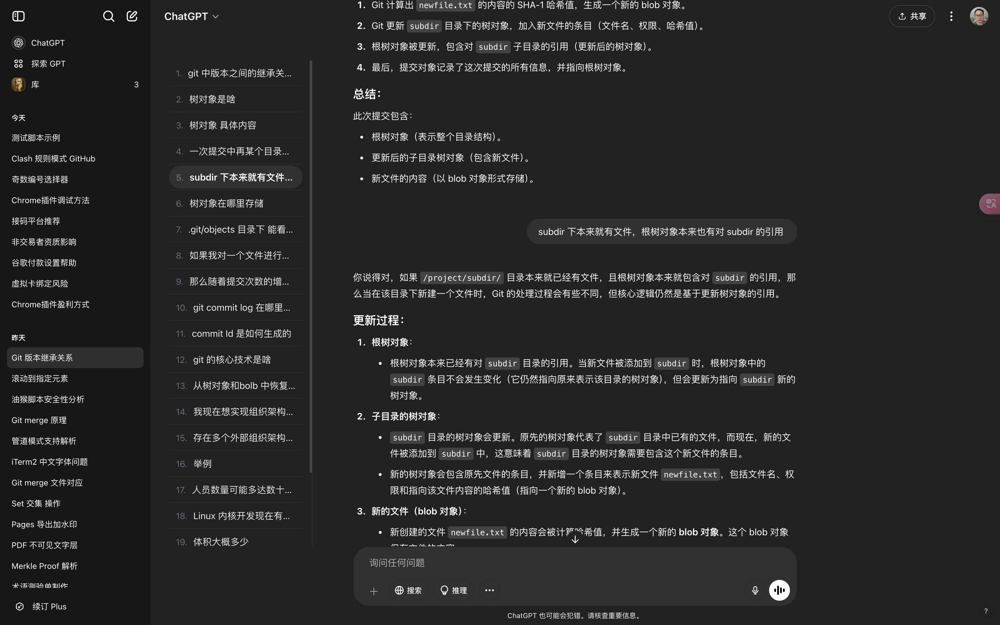
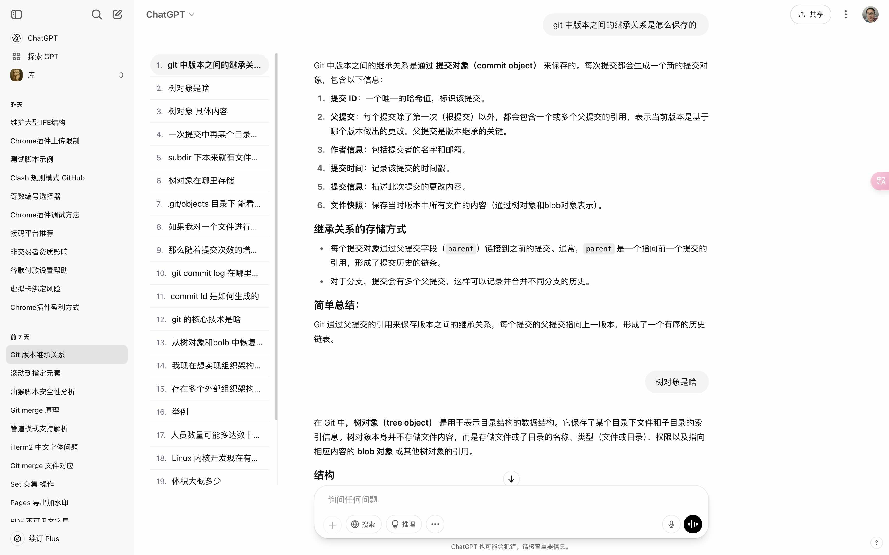

# ChatGPT Conversation Navigator

ChatGPT Conversation Navigator is a user script that provides navigation for multi-turn conversations. It enhances the ChatGPT interface by adding clickable conversation indexes. This tool provides users with a sidebar containing links to each user question, allowing them to easily browse their conversation history.

ChatGPT Conversation Navigator 是一个用户脚本，为多轮对话提供导航。通过添加可点击的对话索引来增强 ChatGPT 界面。该工具为用户提供了一个侧边栏，其中包含每个用户问题的链接，使用户能够轻松浏览其对话历史。

## Features / 功能

- Add clickable conversation indexes on the ChatGPT page.
- Automatically update new messages.
- Clean design and intuitive functionality.

- 在 ChatGPT 页面上添加可点击的对话索引。
- 自动更新新消息。
- 简洁的设计和直观的功能。

## Installation / 安装

1. Make sure you have installed [Tampermonkey](https://www.tampermonkey.net/) or other user script manager.
2. Click [here](https://greasyfork.org/en/scripts/533157-chatgpt-conversation-navigator) to install the script.

1. 确保您已安装 [Tampermonkey](https://www.tampermonkey.net/) 或其他用户脚本管理器。
2. 点击 [这里](https://greasyfork.org/en/scripts/533157-chatgpt-conversation-navigator) 安装脚本。

## Usage / 使用

After installation, the navigator will automatically display on the ChatGPT page. You can quickly access any part of the conversation by clicking on the links in the sidebar.

安装后，导航器将在 ChatGPT 页面上自动显示。您可以通过点击侧边栏中的链接快速访问对话中的任何部分。

## Demo / 效果

  

    
<strong>Dark Mode / 深色模式</strong>

    
  

  

    
<strong>Light Mode / 浅色模式</strong>

    
  

## Todo / 待办事项
- [x] Only display the navigation directory when the conversation exceeds three entries, avoiding visual distraction in short conversations.
- [x] 仅在对话超过三条时才显示导航目录，避免简短对话中的视觉干扰。

## License / 许可证

MIT

## Support / 支持

For help or to report issues, please visit the [support page](https://github.com/tianyw0/ai-conversation-navigator/issues).

如需帮助或报告问题，请访问 [支持页面](https://github.com/tianyw0/ai-conversation-navigator/issues)。

Powered by ChatGPT & [Trae IDE](https://www.trae.ai/)