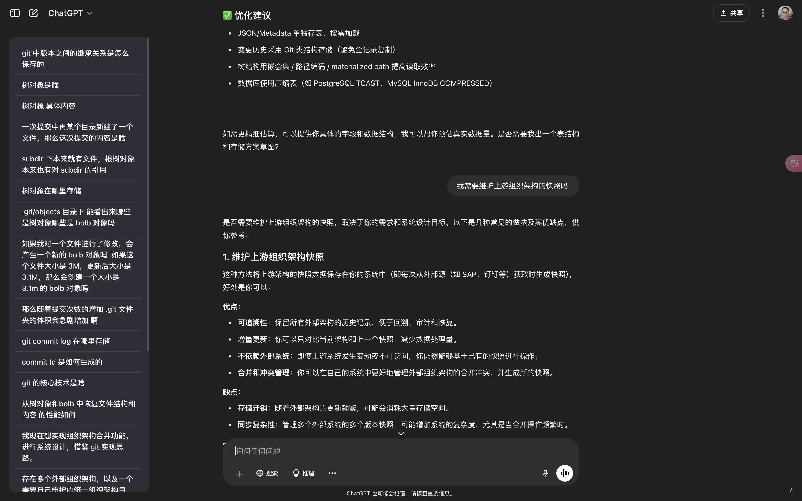

# ChatGPT Conversation Navigator

ChatGPT Conversation Navigator 是一个用户脚本，旨在通过添加可点击的对话索引来增强 ChatGPT 界面。该工具为用户提供了一个侧边栏，其中包含每个用户问题的链接，使用户能够轻松浏览其对话历史。

## 功能

- 在 ChatGPT 页面上添加可点击的对话索引。
- 自动更新新消息。
- 简洁的设计和直观的功能。

## 安装

1. 确保您已安装 [Tampermonkey](https://www.tampermonkey.net/) 或其他用户脚本管理器。
2. 点击 [这里](https://greasyfork.org/en/scripts/533157-chatgpt-conversation-navigator) 安装脚本。

## 使用

安装后，导航器将在 ChatGPT 页面上自动显示。您可以通过点击侧边栏中的链接快速访问对话中的任何部分。

## 演示

## 许可证

MIT

## 支持

如需帮助或报告问题，请访问 [支持页面](https://github.com/tianyw0/ai-conversation-navigator/issues)。