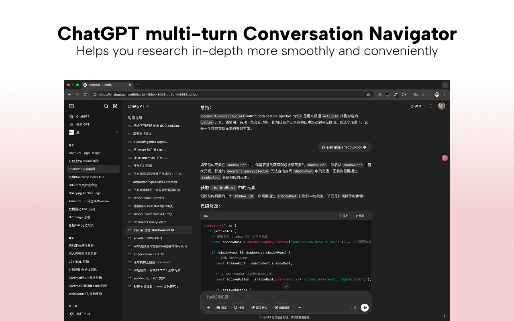

# ChatGPT Conversation Navigator (prompts navigator)

ChatGPT Conversation Navigator is a user script that provides navigation for multi-turn conversations. It enhances the ChatGPT interface by adding clickable conversation indexes. This tool provides users with a sidebar containing links to each user question, allowing them to easily browse their conversation history.

ChatGPT Conversation Navigator 是一个用户脚本，为多轮对话提供导航。通过添加可点击的对话索引来增强 ChatGPT 界面。该工具为用户提供了一个侧边栏，其中包含每个用户问题的链接，使用户能够轻松浏览其对话历史。

## Features / 功能

- Add clickable conversation indexes on the ChatGPT page for easy navigation.
- Automatically track and highlight the current position in the conversation.
- Support both light and dark themes, adapting to ChatGPT's interface.
- Automatically update navigation when new messages are added.
- Only display navigation when conversations exceed three entries.

- 在 ChatGPT 页面上添加可点击的对话索引，便于导航。
- 自动跟踪并高亮显示当前对话位置。
- 支持深色和浅色主题，自动适应 ChatGPT 的界面风格。
- 新消息添加时自动更新导航目录。
- 仅在对话超过三条时才显示导航目录，避免视觉干扰。
- 自动更新新消息。
- 简洁的设计和直观的功能。

## Installation / 安装

**Method 1: Install from Chrome Web Store (Recommended) / 方法一：从 Chrome 应用商店安装 (推荐)**

1. Click [here](https://chromewebstore.google.com/detail/chatgpt-%E5%AF%B9%E8%AF%9D%E5%AF%BC%E8%88%AA%E5%99%A8/phelhffecoejnegmdnboboofmhhmhlcf) to install the extension from Chrome Web Store.

1. 点击 [这里](https://chromewebstore.google.com/detail/chatgpt-%E5%AF%B9%E8%AF%9D%E5%AF%BC%E8%88%AA%E5%99%A8/phelhffecoejnegmdnboboofmhhmhlcf) 从 Chrome 应用商店安装扩展。

**Method 2: Manual Installation / 方法二：手动安装**

1.  Go to the [Releases page](https://github.com/tianyw0/ai-conversation-navigator/releases) of this repository.
2.  Download the latest `chatgpt-conversation-navigator-chrome-vx.x.x.zip` file (or the Firefox equivalent if needed).
3.  Unzip the downloaded file to a local directory.
4.  Open your Chrome browser and navigate to `chrome://extensions`.
5.  Enable "Developer mode" (usually a toggle in the top right corner).
6.  Click on "Load unpacked" and select the directory where you unzipped the extension files.

1.  访问本仓库的 [Releases 页面](https://github.com/tianyw0/ai-conversation-navigator/releases)。
2.  下载最新的 `chatgpt-conversation-navigator-chrome-vx.x.x.zip` 文件 (如果需要，也可以下载 Firefox 版本)。
3.  将下载的 `zip` 文件解压到本地一个文件夹中。
4.  打开您的 Chrome 浏览器，访问 `chrome://extensions`。
5.  启用“开发者模式”（通常在页面右上角有一个开关）。
6.  点击“加载已解压的扩展程序”按钮，然后选择您解压扩展文件所在的文件夹。

## Usage / 使用

After installation, the navigator will automatically display on the ChatGPT page. You can quickly access any part of the conversation by clicking on the links in the sidebar.

安装后，导航器将在 ChatGPT 页面上自动显示。您可以通过点击侧边栏中的链接快速访问对话中的任何部分。

## Demo / 效果

  

    
<strong>Dark Mode / 深色模式</strong>

    
  

  

    
<strong>Light Mode / 浅色模式</strong>

    
  

## License / 许可证

MIT

## Support / 支持

For help or to report issues, please visit the [support page](https://github.com/tianyw0/ai-conversation-navigator/issues).

如需帮助或报告问题，请访问 [支持页面](https://github.com/tianyw0/ai-conversation-navigator/issues)。

Powered by ChatGPT & [Trae IDE](https://www.trae.ai/)